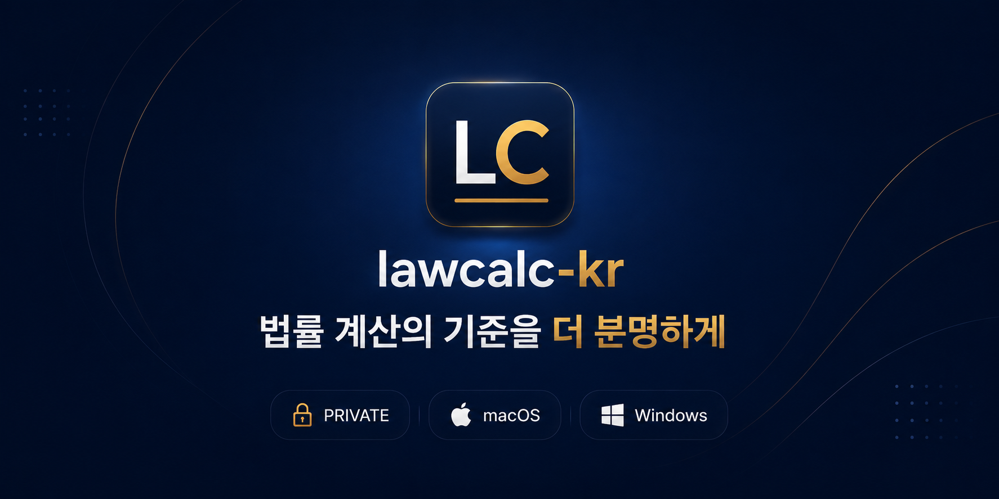
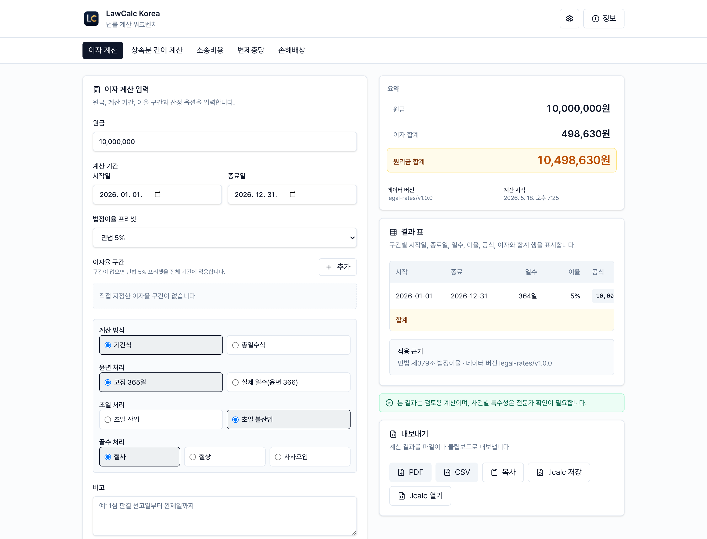
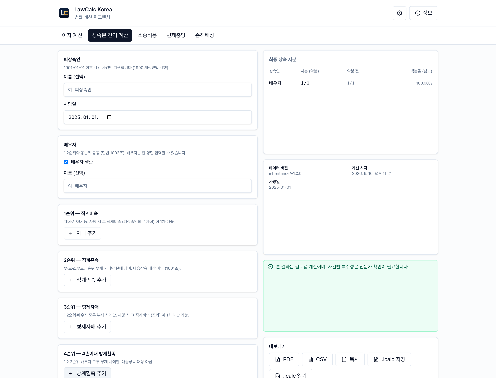
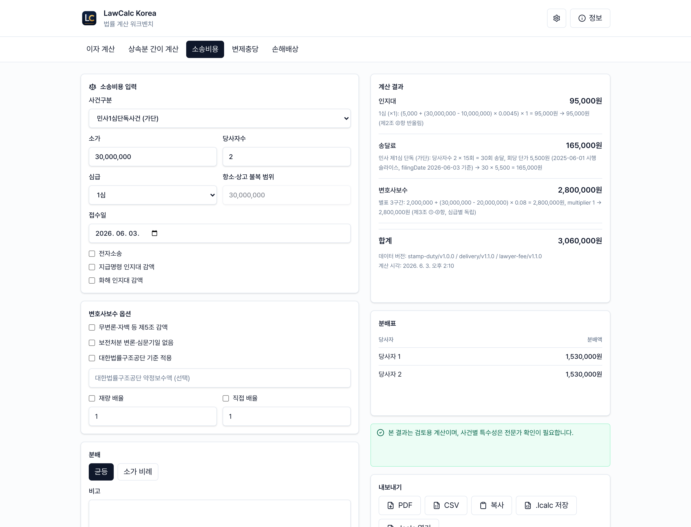
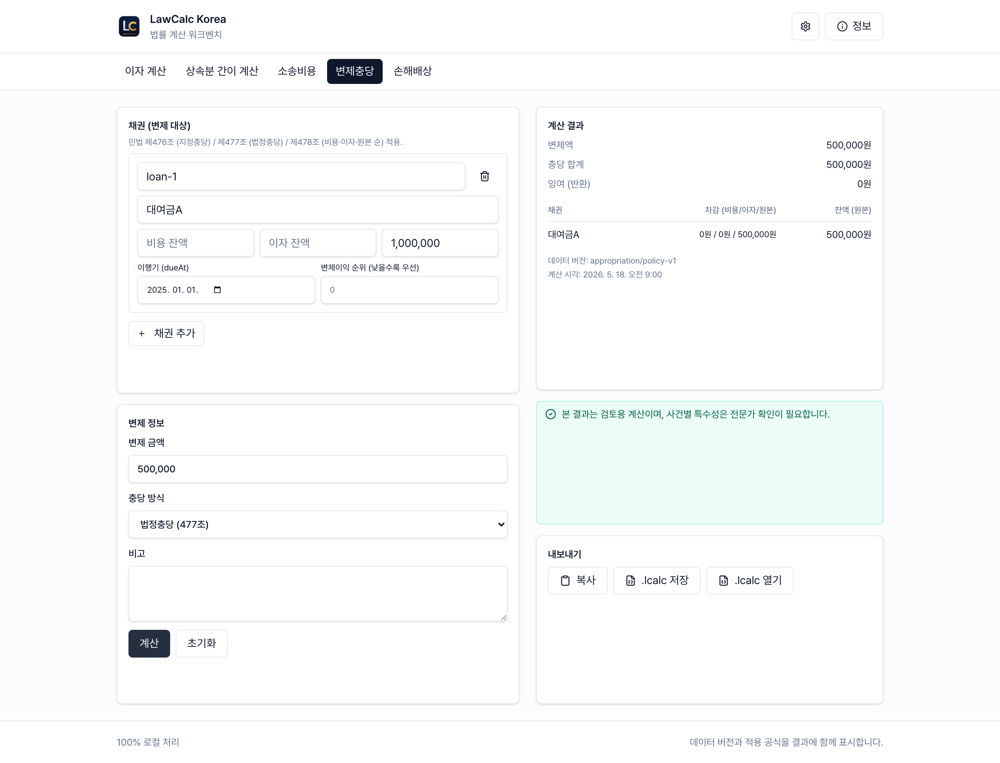
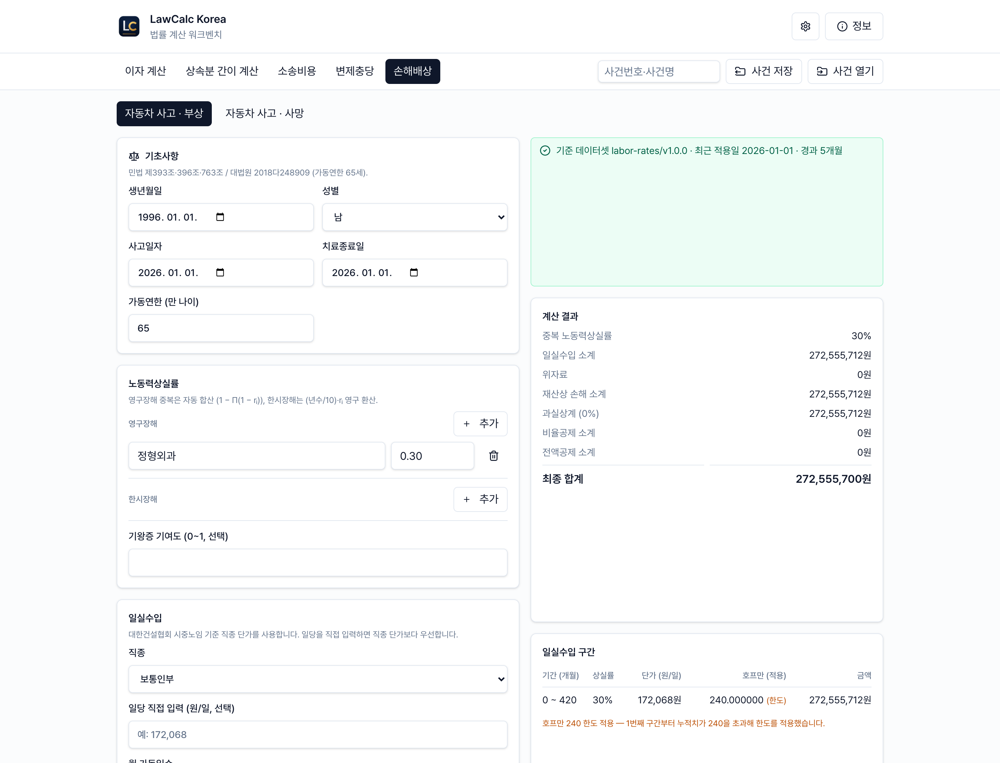
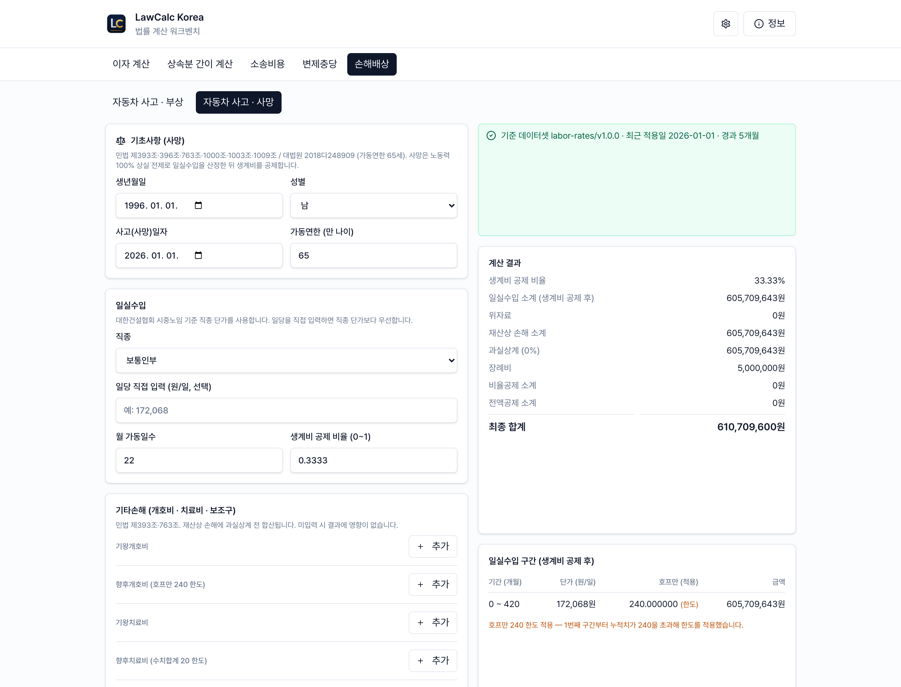
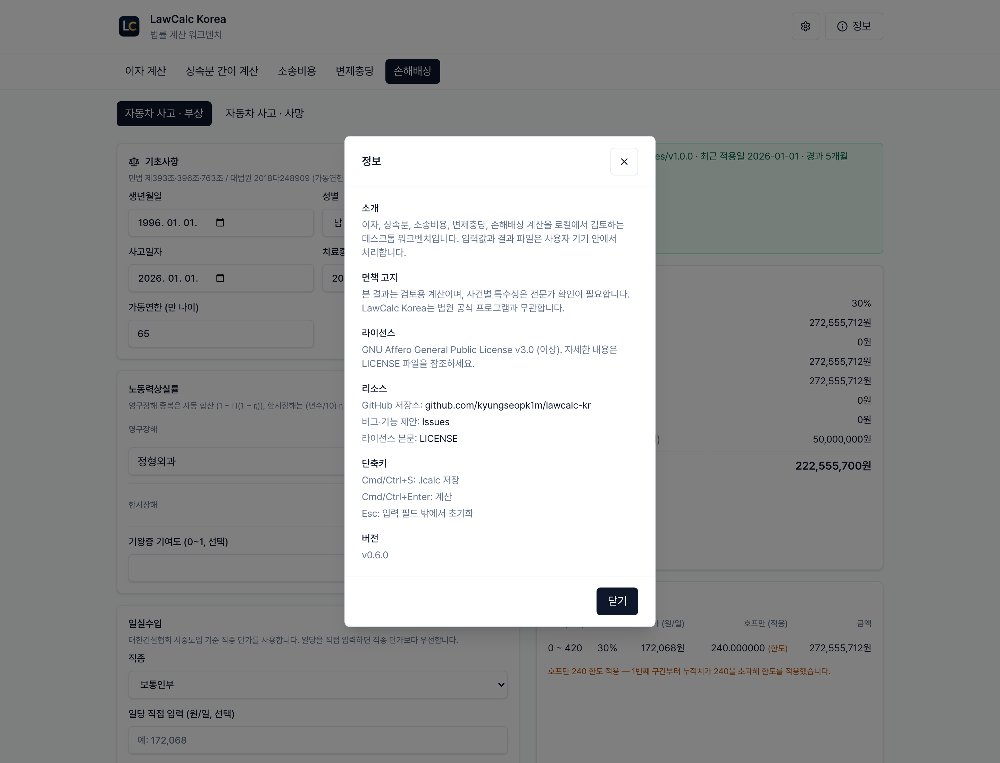

<p align="center">
  
</p>

<h1 align="center">LawCalc Korea</h1>

<p align="center">
  <b>이자·지연손해금, 상속분, 소송비용, 변제충당, 손해배상을 맥·윈도우에서 계산하는 데스크톱 앱</b><br>
  <sub>사건 정보는 기기 밖으로 나가지 않습니다</sub>
</p>

<p align="center">
  
  
  
  
</p>

<p align="center">
  <a href="https://github.com/kyungseopk1m/lawcalc-kr/releases/download/v0.6.0/LawCalc.Korea_0.6.0_universal.dmg"></a>
  &nbsp;
  <a href="https://github.com/kyungseopk1m/lawcalc-kr/releases/download/v0.6.0/LawCalc.Korea_0.6.0_x64-setup.exe"></a>
</p>

> **면책 고지**
> 본 결과는 검토용 계산이며, 사건별 특수성은 전문가 확인이 필요합니다.
> 계산 근거와 독립성 명시: [docs/LEGAL_REFERENCES.md](docs/LEGAL_REFERENCES.md)

법원이 공개한 계산 프로그램은 아직도 윈도우 설치형이라, 맥이나 리눅스에서는 쓸 수 없습니다. 같은 계산을 맥에서도 돌리고 싶어서 만든 앱입니다.

이자, 상속분, 소송비용, 변제충당, 손해배상(자동차·부상) 다섯 가지를 다룹니다. 입력값을 넣으면 구간별 일수·이율·계산식·합계가 표로 펼쳐지고, 어떤 법령과 데이터 버전을 썼는지도 같이 보여줍니다. 결과는 `.lcalc` 파일로 저장하거나 PDF·CSV로 내보낼 수 있고, 전부 로컬에서 처리합니다.

## 주요 기능

### 판결금 이자·지연손해금

<p align="center">
  
</p>

원금과 기간, 이율만 넣으면 됩니다. 법정이율(민법 5%, 상법 6%, 소촉법)은 프리셋으로 고르고, 중간에 이율이 바뀐 구간은 직접 끊어 넣을 수 있습니다. 결과표에 구간마다 일수·이율·계산식·이자·원리금이 그대로 펼쳐져서 검산하기 좋습니다.

### 상속분 간이 계산

<p align="center">
  
</p>

피상속인과 배우자, 1~4순위 상속인, 1차 대습상속인을 넣으면 법정상속분이 나옵니다. 약분 전후 지분과 백분율을 같이 보여줘서 수기로 다시 맞춰보기 편합니다.

지금은 1991-01-01 이후 사망 케이스와 1차 대습상속까지만 지원합니다. 범위는 [docs/LEGAL_REFERENCES.md](docs/LEGAL_REFERENCES.md)의 "현재 상속 범위"를 참고해 주세요.

### 소송비용

<p align="center">
  
</p>

인지대·송달료·변호사보수를 한 번에 계산하고 합계와 분배표까지 만듭니다. 사건구분, 소가, 당사자수, 항소·상고 불복 범위, 전자소송, 지급명령·화해, 변호사보수 감액, 대한법률구조공단 기준, 접수일을 입력할 수 있습니다.

결과에는 항목별 금액과 한국어 산식, 데이터 버전, 균등/소가비례 분배표가 붙습니다. 대한법률구조공단 기준을 쓰면 적용 경고도 같이 뜹니다. 자세한 범위는 [docs/LEGAL_REFERENCES.md](docs/LEGAL_REFERENCES.md)의 "현재 소송비용 범위"에 있습니다.

### 변제충당

<p align="center">
  
</p>

채권 여러 건의 비용·이자·원본 잔액과 변제액을 넣으면 지정충당 또는 법정충당 순서로 차감합니다. 채권별 차감액과 잔액, 데이터 버전, 계산 시각이 결과에 같이 나옵니다.

### 손해배상

<p align="center">
  
</p>

자동차 사고를 **부상**과 **사망** 두 모드로 다룹니다. 손해배상 탭 안에서 모드를 바꾸면 됩니다.

**부상**은 생년월일·사고일자·치료종료일, 영구/한시 노동력상실률, 직종 자동입력 또는 일당 직접 입력, 위자료, 과실비율, 비율/전액 공제를 넣으면 일실수입 구간, 호프만 240 한도, 과실상계·공제까지 거쳐 최종 합계가 나옵니다.

<p align="center">
  
</p>

**사망**은 일실수입에서 생계비를 공제(기본 1/3)하고, 과실상계 뒤에 장례비(기본 500만 원)를 더합니다. 상속인을 입력하면 최종액을 법정상속분대로 상속인별로 나눠 보여줍니다. 상속분 계산은 1991-01-01 이후 사망 케이스를 대상으로 합니다.

두 모드 모두 결과에 쓰인 데이터셋(`labor-rates` / `life-expectancy` / `hoffman` / `leibniz`) 식별자와 대한건설협회 시중노임 스냅샷 경과 안내가 붙습니다.

| 데이터셋                            | 출처와 처리                                                                                                                                  |
| ----------------------------------- | -------------------------------------------------------------------------------------------------------------------------------------------- |
| `labor-rates/v1.0.0`                | 대한건설협회 시중노임 단가. 프로젝트 라이선스 검토에서 허용된 방식으로 번들하며, 앱은 직종 자동입력과 일당 직접 입력을 항상 함께 제공합니다. |
| `life-expectancy/v1.0.0`            | 통계청 KOSIS 생명표. KOSIS 이용 안내상 자유 이용·재사용·재배포 가능 범위로 확인하고 출처표시·왜곡 금지 원칙을 따릅니다.                      |
| `hoffman/v1.0.0` / `leibniz/v1.0.0` | 할인율 5% 기준 정적 수학표입니다. 호프만 표는 월 단위 단리연금현가율과 240 한도 정보를 포함합니다.                                           |

### 공통 기능

<p align="center">
  
</p>

- **법정이율 데이터셋** — 민법 5%, 상법 6%, 소촉법 등 이율 변경 이력을 버전으로 관리합니다.
- **계산 옵션** — 초일 산입 여부, 윤년 처리, 원 단위 절사·절상·반올림을 고를 수 있습니다.
- **로컬 저장 (`.lcalc`)** — 입력값·옵션·결과·데이터 버전을 한 파일에 담아 같은 계산을 다시 엽니다.
- **내보내기** — PDF, CSV, 클립보드 텍스트.

## 다운로드

릴리스 자산은 [GitHub Releases](https://github.com/kyungseopk1m/lawcalc-kr/releases/latest)에 있습니다.

### macOS

`.dmg`를 받아 앱을 Applications로 옮기고 실행하면 됩니다. 아직 Apple Notarization을 안 해서 Gatekeeper 경고가 뜰 수 있는데, Finder에서 앱을 **Control-클릭 → 열기** 한 번 하거나 **시스템 설정 → 개인정보 보호 및 보안**에서 실행을 허용하면 됩니다.

### Windows

`setup.exe`를 받아 설치 마법사를 따라가면 됩니다. 기관/관리자 배포가 필요하면 `.msi`를 쓰세요. Windows SmartScreen이 "게시자 확인 안 됨"으로 막을 수 있는데, 직접 받은 파일이 맞다면 **추가 정보 → 실행**으로 넘어가면 됩니다.

`latest.json`, `.sig`, `.app.tar.gz`는 인앱 자동업데이트 검증용이라 직접 받을 필요 없습니다.

## `.lcalc` 파일

`.lcalc`는 입력값·옵션·데이터 버전·결과·면책 고지를 한 데 묶은 JSON 파일입니다. 사건 정보는 서버로 보내지 않고 이 파일로만 로컬에 남습니다.

지금 저장 형식은 `schemaVersion: "3"`이고, `kind`로 `interest` / `inheritance` / `litigation-cost` / `appropriation` / `compensation`을 구분합니다. v0.1.x/v0.2.x 파일은 열 때 v3로 자동 마이그레이션됩니다.

## 개발

Node.js 24 · pnpm 10 · Rust stable이 필요합니다.

```bash
pnpm install
pnpm tauri:dev      # 데스크톱 앱 개발 모드
pnpm tauri:build    # 릴리스 패키징 (.dmg / .msi)
pnpm test           # 단위·통합 테스트
pnpm test:golden    # 골든 케이스 회귀 테스트
pnpm lint           # ESLint + Prettier
node scripts/capture-screens.mjs  # README 스크린샷 재캡처
```

기여 절차·릴리스 워크플로·테스트 정책은 [`CONTRIBUTING.md`](CONTRIBUTING.md)에 있습니다. 버그 신고와 기능 제안은 [Issues](https://github.com/kyungseopk1m/lawcalc-kr/issues)로 받습니다.

## 헌사 / Acknowledgments

이 프로젝트는 2007년 광주지방법원 정경현 부장판사님이 업무용 계산프로그램(VK.EXE)을 일반 공개하면서 시작된 흐름 위에 있습니다. 법률 계산 도구를 모두에게 열어 주신 그 결정에 깊은 경의를 표합니다.

This project stands on the shoulders of Hon. Jung Kyungheon (J., Gwangju District Court), whose 2007 public release of the VK.EXE court calculation utility first made these calculations accessible to everyone.

## 라이선스

GNU Affero General Public License v3.0 (이상)으로 배포합니다. 누구나 자유롭게 쓰고·고치고·재배포할 수 있고, 수정본을 네트워크 서비스로 제공하거나 재배포할 때는 같은 라이선스로 소스를 공개해야 합니다. 자세한 내용은 [LICENSE](LICENSE)에 있습니다. 상업 라이선스가 필요하면 Licensor (kyungseopk1m)에게 문의해 주세요.

> **의무 발동 조건 예시**
>
> - 변호사·법무팀이 사무소·기업 내부에서 데스크톱 앱으로 사용 → AGPL 의무 발동 없음 (내부 사용).
> - 이 코드를 SaaS·웹·다중 사용자 시스템에 통합해 외부에 제공 → 같은 라이선스로 소스 공개 강제.

## English

LawCalc Korea is a Korean legal calculation desktop app for judgment interest, statutory delay damages, simplified inheritance shares, litigation costs, payment appropriation, and the first auto/injury compensation slice.

The current release runs locally on macOS and Windows — interest, inheritance, litigation-cost, appropriation, and compensation calculations, transparent result traces, versioned data, and reproducible `.lcalc` files.

Distributed under the GNU Affero General Public License v3.0 or later. Any modified version made available to users over a network — or redistributed as a derivative work — must be released under the same license with source code available. See [LICENSE](LICENSE) for the full text. For commercial licensing inquiries, please contact the Licensor (kyungseopk1m).
