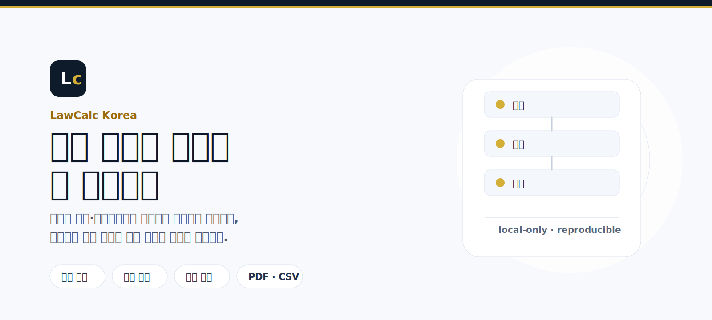

<p align="center">
  
</p>

<h1 align="center">LawCalc Korea</h1>

<p align="center">
  <b>판결금 이자·지연손해금과 상속분을 로컬에서 계산하는 데스크톱 워크벤치</b><br>
  <sub>본질에 집중한 법률 계산 워크벤치 · 사건 정보는 외부로 전송하지 않습니다</sub>
</p>

<p align="center">
  
  
  
  
</p>

<p align="center">
  <a href="https://github.com/kyungseopk1m/lawcalc-kr/releases/download/v0.2.5/LawCalc.Korea_0.2.5_universal.dmg"></a>
  &nbsp;
  <a href="https://github.com/kyungseopk1m/lawcalc-kr/releases/download/v0.2.5/LawCalc.Korea_0.2.5_x64-setup.exe"></a>
</p>

> **면책 고지**
> 이 도구의 계산 결과는 **검토용**이며 법률 자문이 아닙니다. 사건별 특수성은 변호사 등 전문가의 확인이 필요합니다.
> 계산 근거와 독립성 명시: [docs/LEGAL_REFERENCES.md](docs/LEGAL_REFERENCES.md)

LawCalc Korea는 반복되는 법률 계산을 검산 가능한 형태로 정리하는 로컬 데스크톱 앱입니다. 원금·기간·이율처럼 자주 바뀌는 입력값부터 결과표, 적용 근거, 저장·내보내기까지 한 흐름에서 다룹니다.

## 주요 기능

### 판결금 이자·지연손해금 계산

<p align="center">
  
</p>

원금, 계산 기간, 법정이율 프리셋, 직접 지정한 이율 구간을 조합해 계산합니다. 결과표에는 구간별 일수, 적용 이율, 계산 공식, 이자, 원리금 합계가 함께 표시됩니다.

### 상속분 간이 계산

<p align="center">
  
</p>

피상속인, 배우자, 1~4순위 상속인과 1차 대습상속인을 입력해 법정상속분을 계산합니다. 결과에는 약분 전/후 지분과 백분율을 함께 표시해 검산하기 쉽게 정리합니다.

현재 상속분 계산은 1991-01-01 이후 사망 케이스와 1차 대습상속까지만 지원합니다. 자세한 범위는 [docs/LEGAL_REFERENCES.md](docs/LEGAL_REFERENCES.md)의 “Current Inheritance Scope”를 확인해 주세요.

### 공통 워크플로

- **법정이율 데이터셋** — 민법 5%, 상법 6%, 소송촉진 등에 관한 특례법 이율 변경 이력을 버전 관리합니다.
- **계산 옵션** — 초일 산입 여부, 윤년 처리, 원 단위 절사·절상·사사오입을 선택할 수 있습니다.
- **로컬 저장 (`.lcalc`)** — 입력값, 옵션, 결과, 데이터 버전을 한 파일로 저장해 같은 계산을 다시 열 수 있습니다.
- **내보내기** — PDF, CSV, 클립보드 텍스트로 계산 결과를 정리합니다.

## 다운로드

릴리스 자산은 [GitHub Releases](https://github.com/kyungseopk1m/lawcalc-kr/releases/latest) 에서 받을 수 있습니다.

### macOS

1. 일반 사용자는 `.dmg` 설치 파일을 내려받아 앱을 Applications 폴더로 옮긴 뒤 실행합니다.
2. 현재는 Apple Notarization 을 진행하지 않아 Gatekeeper 경고가 표시될 수 있습니다.
   - Finder 에서 앱을 **Control-클릭 → 열기** 를 한 번 선택하거나
   - **시스템 설정 → 개인정보 보호 및 보안** 에서 실행을 허용해 주세요.

### Windows

1. 일반 사용자는 `setup.exe` 설치 파일을 내려받아 설치 마법사를 따릅니다.
   - 기관/관리자 배포가 필요한 경우 `.msi` 설치 파일을 사용할 수 있습니다.
2. Windows SmartScreen 이 "게시자 확인 안 됨" 으로 표시될 수 있습니다. 본인이 직접 받은 파일임을 확인한 뒤 **추가 정보 → 실행** 으로 진행합니다.

`latest.json`, `.sig`, `.app.tar.gz` 파일은 인앱 자동업데이트 검증용 자산이므로 일반 사용자가 직접 내려받을 필요는 없습니다.

## `.lcalc` 파일

`.lcalc` 는 입력값·계산 옵션·적용 데이터 버전·결과·면책 고지를 한 데 묶어 저장하는 재현용 JSON 파일입니다. 사건 정보는 외부 서버로 전송하지 않고 로컬 파일로만 저장됩니다.

현재 저장 형식은 `schemaVersion: "2"` envelope 입니다. `kind` 값으로 `interest` 또는 `inheritance` 계산 유형을 구분하고, v0.1.x 의 `schemaVersion: "1"` 이자 계산 파일은 불러올 때 v2 로 자동 마이그레이션됩니다. `dataVersion` 은 동일 입력에 대한 계산 재현성을 판단하는 기준입니다.

## 개발

요구사항: Node.js 24 · pnpm 10 · Rust stable.

```bash
pnpm install
pnpm tauri:dev      # 데스크톱 앱 개발 모드
pnpm tauri:build    # 릴리스 패키징 (.dmg / .msi)
pnpm test           # 단위·통합 테스트
pnpm test:golden    # 골든 케이스 회귀 테스트
pnpm lint           # ESLint + Prettier
```

기여 절차·릴리스 워크플로·테스트 정책은 [`CONTRIBUTING.md`](CONTRIBUTING.md) 를 참고해 주세요. 버그 신고와 기능 제안은 [Issues](https://github.com/kyungseopk1m/lawcalc-kr/issues) 에서 받습니다.

## Acknowledgments

이 프로젝트는 2007년 광주지방법원 정경현 부장판사님이 업무용 계산프로그램(VK.EXE)을 일반에 공개하면서 시작된 흐름 위에 있습니다. 법률 계산 도구를 모두에게 열어 주신 그 결정에 깊은 경의를 표합니다.

This project stands on the shoulders of Hon. Jung Kyungheon (J., Gwangju District Court), whose 2007 public release of the VK.EXE court calculation utility first made these calculations accessible to everyone.

## 라이선스

이 프로젝트는 GNU Affero General Public License v3.0 (이상)으로 배포됩니다. 누구나 자유롭게 사용·수정·재배포할 수 있으며, 수정본을 네트워크 서비스로 제공하거나 재배포할 경우 동일 라이선스로 source code 를 공개해야 합니다. 자세한 내용은 [LICENSE](LICENSE) 를 확인하세요.

상업 라이선스가 필요한 경우 Licensor (kyungseopk1m) 에게 문의해 주세요.

> **사용 예시 / 의무 발동 조건**
>
> - 변호사·법무팀이 본인 사무소·기업 내부에서 stand-alone 데스크톱 앱으로 사용 → AGPL 의무 발동 0 (internal use).
> - 본 코드를 자체 SaaS·웹·다중 사용자 시스템에 통합해 외부에 제공 → 동일 라이선스로 source 공개 강제.

## English

LawCalc Korea is a Korean legal calculation desktop workbench for reviewing judgment interest, statutory delay damages, and simplified inheritance shares.

The current release focuses on local-only interest and inheritance calculations, transparent result traces, versioned data, and reproducible `.lcalc` files on macOS and Windows.

Distributed under the GNU Affero General Public License v3.0 or later. Any modified version made available to users over a network — or redistributed as a derivative work — must be released under the same license with source code available. See [LICENSE](LICENSE) for the full text. For commercial licensing inquiries, please contact the Licensor (kyungseopk1m).
