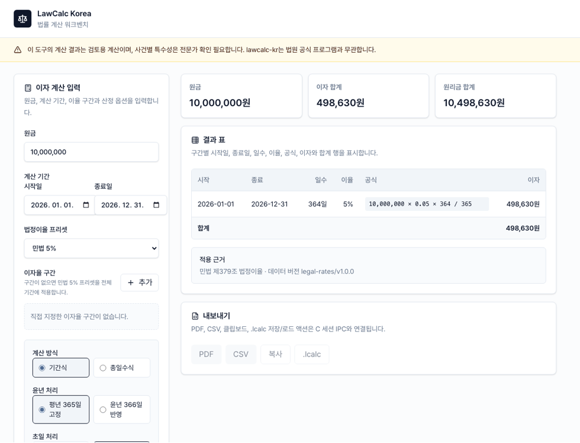

# lawcalc-kr — 한국 법률 계산 워크벤치

## 판결금 이자 계산기 (맥/윈도우)

lawcalc-kr는 판결금 이자, 지연손해금 계산, 손해배상 이자 산정을 검토하기 위한 로컬 데스크톱 법률 계산기입니다. 민감한 사건 정보를 외부 서버로 보내지 않고, macOS와 Windows에서 같은 입력·같은 법정이율 데이터·같은 계산 근거를 확인하는 것을 목표로 합니다.

> **면책 고지**
>
> 이 도구의 계산 결과는 검토용이며 법률 자문이 아닙니다. 사건별 특수성은 변호사 등 전문가 확인이 필요합니다.
> lawcalc-kr는 법원 공식 프로그램과 무관한 독립 오픈소스 프로젝트입니다.

## 데모



## v0.1.0 기능

| 구분                   | 제공 범위                                                                                                   |
| ---------------------- | ----------------------------------------------------------------------------------------------------------- |
| 판결금·지연손해금 계산 | 원금, 시작일, 종료일, 이자율 구간, 초일 산입, 윤년 처리 옵션 기반 계산                                      |
| 법정이율 프리셋        | 민법 5%, 상법 6%, 소송촉진 등에 관한 특례법 이율 변경 이력 반영                                             |
| 끝수 처리              | 원 단위 절사, 절상, 사사오입 옵션 지원. 미지정 시 절사                                                      |
| 계산 근거 표시         | 구간별 일수, 이율, 공식, 이자와 총액 표시                                                                   |
| 로컬 저장              | `.lcalc` JSON 파일로 입력값, 옵션, 결과, 데이터 버전 저장·로드                                              |
| 내보내기               | CSV/PDF/클립보드는 v0.2 후보입니다. v0.1.0에서 완성되지 않은 출력 기능은 사용자 노출 UI에서 비활성화합니다. |

## 설치

### macOS

1. GitHub Releases에서 macOS용 `.dmg` 또는 `.app.tar.gz` 자산을 내려받습니다.
2. 앱을 Applications 폴더로 옮긴 뒤 실행합니다.
3. v0.1.0은 Apple notarization을 아직 진행하지 않았습니다. Gatekeeper 경고가 뜨면 Finder에서 앱을 Control-클릭한 뒤 `열기`를 선택하거나, 시스템 설정의 개인정보 보호 및 보안에서 실행을 허용합니다.

### Windows

1. GitHub Releases에서 Windows용 `.msi` 설치 파일을 내려받습니다.
2. 설치 마법사를 따라 설치합니다.
3. Windows SmartScreen 경고가 표시되면 게시자 미확인 상태를 확인한 뒤 내부 테스트 목적에 맞게 실행 여부를 결정합니다.

## .lcalc 파일

`.lcalc`는 입력값, 계산 옵션, 적용 법정이율 데이터 버전, 결과, 면책 고지를 함께 저장하는 재현용 JSON 파일입니다. 사건 정보는 외부 서버로 전송하지 않고 로컬 파일로만 저장합니다.

v0.1.x는 `schemaVersion: "1"` 파일의 하위 호환을 유지합니다. 새 버전에서 필드가 추가되더라도 기존 파일은 읽을 수 있어야 하며, 저장된 `dataVersion`은 계산 재현성을 판단하는 기준입니다.

## 개발

요구사항:

- Node.js 24
- pnpm 10
- Rust stable

```bash
pnpm install
pnpm lint
pnpm test
pnpm test:golden
pnpm build
```

데스크톱 앱 실행과 패키징:

```bash
pnpm tauri:dev
pnpm tauri:build
```

## 문서

- [아키텍처](docs/ARCHITECTURE.md)
- [법령 및 공식 자료 참조](docs/LEGAL_REFERENCES.md)
- [면책 정책](docs/DISCLAIMER.md)
- [테스트 전략](docs/TESTING.md)
- [개발 워크플로](docs/DEV_WORKFLOW.md)
- [릴리스 체크리스트](docs/RELEASE.md)
- [첫 사용자 테스트 계획](docs/USER_TEST_PLAN.md)

## 라이선스

이 프로젝트는 Business Source License 1.1로 배포되며, 2031-05-09에 Apache License 2.0으로 전환됩니다. 자세한 내용은 [LICENSE](LICENSE)와 [LICENSE.future](LICENSE.future)를 확인하세요.

## English

lawcalc-kr is a Korean legal calculation desktop workbench for reviewing judgment interest and statutory delay damages. The project is independent from Korean court software and does not use court logos, screens, or reverse-engineered program internals.

The v0.1.0 release focuses on local-only interest calculation, transparent formulas, legal-rate data versions, and reproducible `.lcalc` files on macOS and Windows.

### License

Distributed under the Business Source License 1.1 with a Change Date of 2031-05-09, after which the licensed work converts to the Apache License 2.0. See [LICENSE](LICENSE) and [LICENSE.future](LICENSE.future) for the full text.
