<p align="center">
  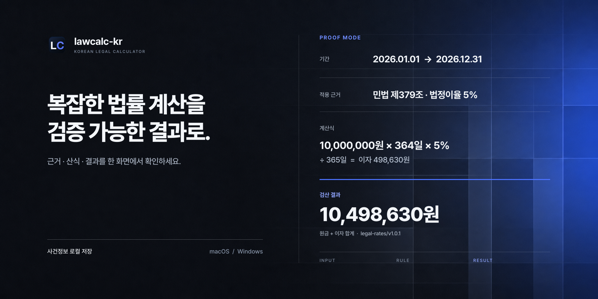
</p>

<h1 align="center">LawCalc Korea</h1>

<p align="center">
  <b>이자·지연손해금, 상속분, 소송비용, 변제충당, 손해배상과 기간·법정기한을 맥·윈도우에서 계산하는 데스크톱 앱</b><br>
  <sub>사건 정보는 내 컴퓨터 밖으로 나가지 않습니다</sub>
</p>

<p align="center">
  
  
  
  
</p>

<p align="center">
  <a href="https://github.com/kyungseopk1m/lawcalc-kr/releases/download/v0.12.2/LawCalc.Korea_0.12.2_universal.dmg"></a>
  &nbsp;
  <a href="https://github.com/kyungseopk1m/lawcalc-kr/releases/download/v0.12.2/LawCalc.Korea_0.12.2_x64-setup.exe"></a>
</p>

> **면책 고지**
> 본 결과는 검토용 계산이며, 사건별 특수성은 전문가 확인이 필요합니다.
> 계산 근거와 독립성 명시: [docs/LEGAL_REFERENCES.md](docs/LEGAL_REFERENCES.md)

법원이 공개한 계산 프로그램은 윈도우 전용이라 맥·리눅스에서는 쓸 수 없습니다. 이제 같은 계산이 맥OS에서도 가능합니다.

금액을 내는 계산은 이자, 상속분, 소송비용, 변제충당, 손해배상 다섯 가지이고, 날짜를 내는 계산으로 기간과 불변기한 두 가지가 있습니다. 값을 넣으면 구간별 일수·이율·계산식·합계가 표로 펼쳐지고, 어떤 법령과 데이터를 썼는지도 함께 보여줍니다. 결과는 `.lcalc` 파일이나 PDF·CSV로 내보낼 수 있고, 여러 탭의 계산을 사건 하나로 묶을 수도 있습니다.

## 주요 기능

### 판결금 이자·지연손해금

<p align="center">
  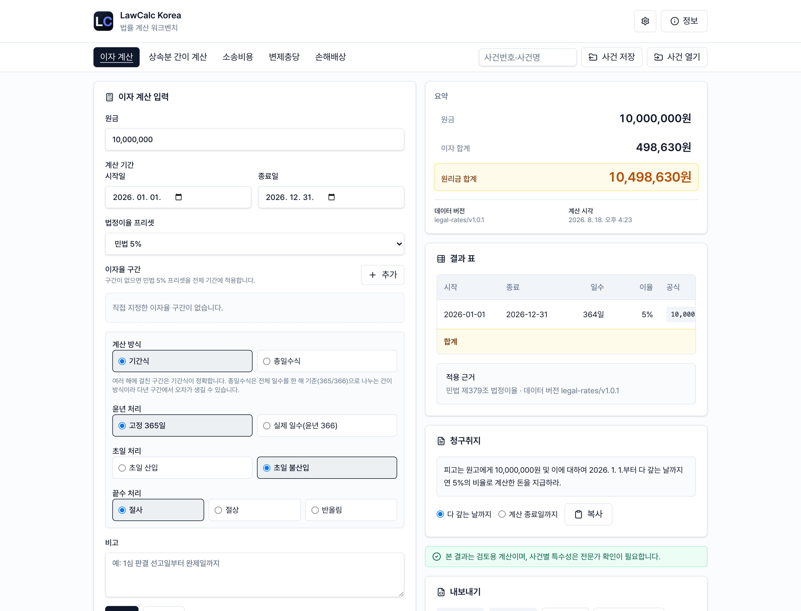
</p>

원금·기간·이율만 넣으면 됩니다. 법정이율(민법 5%, 상법 6%, 소촉법)은 프리셋으로 고르고, 중간에 이율이 바뀌면 그 구간을 끊어 넣습니다. 결과표에는 구간마다 일수·이율·계산식·이자·원리금이 펼쳐져 검산하기 좋습니다.

계산 옵션의 **법원 방식 적용** 버튼을 누르면 기간식·실제 일수(윤년 366)·초일 산입·절사가 한 번에 맞춰집니다.

결과를 청구취지 문구로도 만들어 줍니다. 문장을 복사해 소장이나 지급명령 신청서에 붙이면 됩니다.

> 법원 기재례를 따라 '원금 및 이에 대하여 ○○부터 다 갚는 날까지 연 ○%의 비율로 계산한 돈' 형식으로 나옵니다(이율이 여러 구간이면 "각 비율").

### 상속분 간이 계산

<p align="center">
  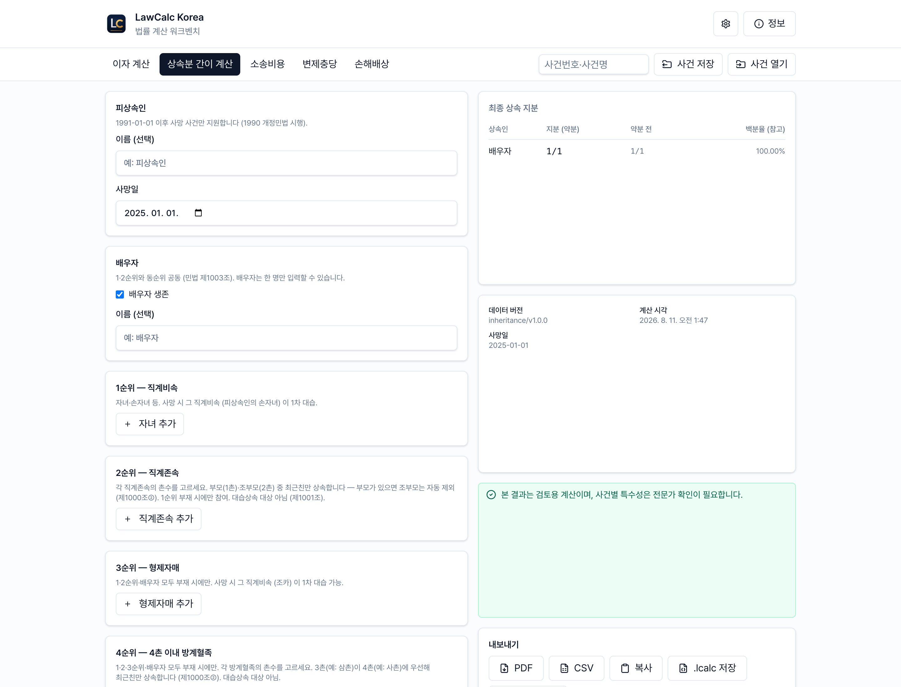
</p>

피상속인·배우자·1~4순위 상속인·1차 대습상속인을 넣으면 법정상속분이 나옵니다. 약분 전후 지분과 백분율을 함께 보여줘서 수기로 다시 맞춰보기 편합니다.

상속인마다 **상속포기**(제1041조)를 체크할 수 있고, 대습이 생긴 **원인**(상속개시 전 사망 / 상속결격 / 상속권 상실선고)을 고를 수 있습니다. 원인을 구분하는 이유는 2026. 3. 17. 개정 제1003조 제2항이 대습 배우자를 "상속개시전에 사망한 사람의 배우자"로 좁혔기 때문입니다. 시행일 이후 개시된 상속에서는 결격·상실이 원인이면 피대습자의 배우자가 대습분을 받지 못하고, 직계비속 대습은 그대로 유지됩니다. 대습상속인 각자의 포기도 따로 체크할 수 있습니다.

지금은 1991-01-01 이후 사망 케이스와 1차 대습상속까지 지원합니다. 자세한 범위는 [docs/LEGAL_REFERENCES.md](docs/LEGAL_REFERENCES.md)의 '현재 상속 범위'를 참고해 주세요.

### 소송비용

<p align="center">
  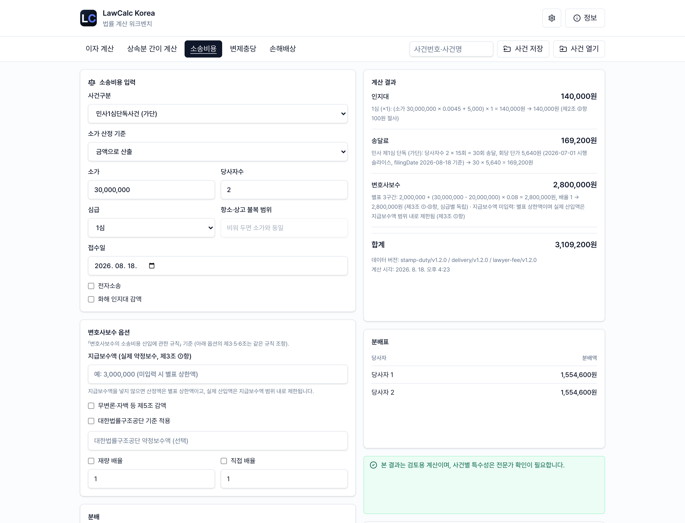
</p>

인지대·송달료·변호사보수를 한 번에 계산하고, 합계와 분배표까지 만듭니다. 입력 항목은 사건구분·소가·소가 산정 기준·당사자수, 항소·상고 불복 범위, 전자소송 여부, 화해, 지급보수액, 변호사보수 감액, 대한법률구조공단 기준, 보전 신청사건 성격, 접수일입니다. 지급명령 감액과 가압류·가처분 인지는 사건구분을 고르면 함께 적용됩니다.

소가를 산출할 수 없는 사건은 **소가 산정 기준**에서 간주 소가(5,000만원 또는 1억원)를 고르면 됩니다(인지규칙 제18조의2). 항소·상고는 불복 범위를 기준으로 인지액을 산정하되(인지규칙 제25조), 전체 소가도 파일에 함께 남습니다. 항고·재항고 사건은 **원신청서 인지액**을 넣으면 그 2배로 계산하고(인지법 제11조 제1항), 비워 두면 제11조 제2항의 2,000원 정액이 적용됩니다. 조정신청은 신청 수수료만 있어 심급을 고를 수 없습니다.

결과에는 항목별 금액과 한국어 산식, 데이터 버전, 분배표(균등 또는 소가비례)가 붙습니다. 대한법률구조공단 기준을 쓰면 적용 경고도 함께 뜹니다. 자세한 범위는 [docs/LEGAL_REFERENCES.md](docs/LEGAL_REFERENCES.md)의 '현재 소송비용 범위'에 있습니다.

### 변제충당

<p align="center">
  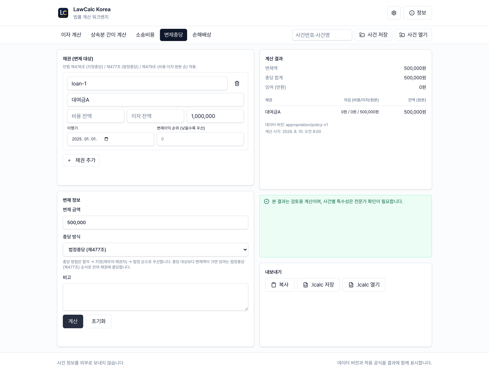
</p>

채권 여러 건의 비용·이자·원본 잔액과 변제액을 넣으면 지정충당 또는 법정충당 순서로 차감합니다. **변제일**을 넣으면 그 날짜를 기준으로 변제기 도래 여부를 판정합니다(제477조 제1호). 비워 두면 오늘 날짜로 보므로, 과거 변제를 재현하거나 저장한 파일을 다시 열 때는 실제 변제일을 넣어야 합니다.

결과에는 채권별 **충당 순위**(변제기 도래 여부와 변제이익 순위, 동순위면 비례 안분)와 차감액·잔액, 데이터 버전, 계산 시각이 함께 나옵니다.

### 손해배상

<p align="center">
  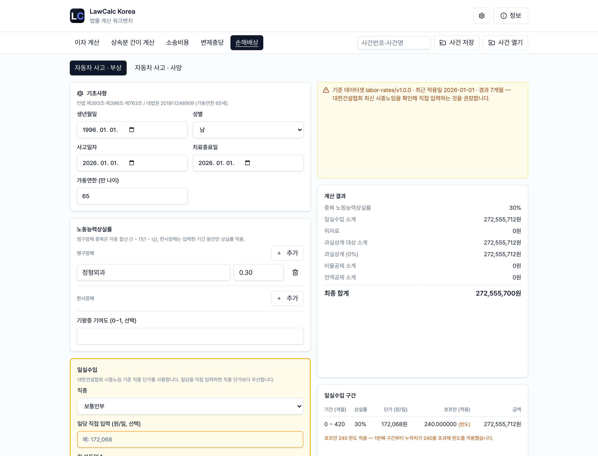
</p>

자동차 사고와 산업재해를 **부상**·**사망** 모드로 다룹니다. 손해배상 탭에서 모드를 바꾸고, 각 모드에서 사건종류(자동차 또는 산재)를 고르면 됩니다.

**부상**은 기초사항(생년월일·사고일자·입원치료 종료일), 노동능력상실률, 일실수입, 위자료, 과실비율, 공제를 입력합니다. 그러면 일실수입을 구간별로 계산하고, 중간이자(호프만식, 240개월 한도)·과실상계·공제를 거쳐 최종 합계를 냅니다. 노동능력상실률은 영구·한시로 나눠 넣을 수 있고, 일당은 직종 자동입력이나 직접 입력 중에 고릅니다.

사고일부터 입원치료 종료일까지는 노동능력상실률 100%로 계산합니다(월 단위 내림, 기왕증 미적용). 선택으로 끌 수 있고, 이전 버전에서 저장한 파일은 이 옵션이 꺼진 상태로 열립니다. 월 가동일수는 기본 20일입니다. 대법원 2024. 4. 25. 선고 2020다271650 판결이 2014년 사고 당시 도시 일용근로자의 월 가동일수는 특별한 사정이 없는 한 20일을 초과하여 인정하기 어렵다고 보았기 때문이며, 앱은 사고 시기와 무관하게 기본 20일을 쓰고 직접 바꿀 수 있습니다.

노임단가는 **계산 기준일**(변론종결 예정일, 기본 오늘)까지 공표된 단가가 바뀐 날마다 기간을 나눠 계산하고(판결 계산표와 법원 손해배상 계산 프로그램 예시의 방식), 그 뒤 장래분은 그날의 단가를 씁니다(대법원 94다31334: "변론종결 당시의 일반노동임금"). 향후개호비도 같이 나누고, 기왕개호비는 사고일 단가 하나로 계산합니다. 적용일 규약은 조사 시점(5/1·9/1, 기본)과 공표 적용일(1/1·9/1) 중에서 고릅니다. 구간표에는 구간마다 초일·말일과 단가가 나옵니다.

공제는 세 종류입니다. **비율공제**는 항목 금액 × [1 − (1 − 기왕증)(1 − 과실)]을 빼고(법원 손해배상 계산 프로그램 방식), **지급치료비**는 보험사 등이 이미 지급한 치료비를 기왕치료비에 넣지 않고 이 칸에만 넣으면 같은 계수만큼 뺍니다(기왕치료비에 이미 넣었다면 전액공제에 넣습니다). 두 공제는 재산상 손해 안에서만 빼고 위자료를 줄이지 않습니다. 선급금 같은 **전액공제**는 그대로 빼고, 재산상 손해를 넘으면 위자료에서 뺍니다(이 처리는 판례로 확인하지 못해 바뀔 수 있습니다). 이전 버전 파일의 비율공제(과실상계 후 금액 × 비율)는 이전 방식 그대로 보존해 엽니다.

<p align="center">
  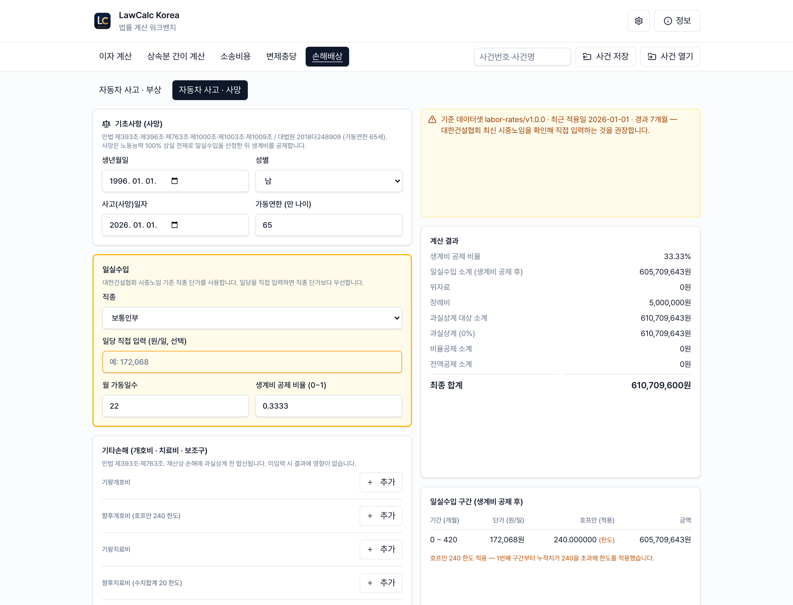
</p>

**사망**은 일실수입에서 생계비를 공제하고(기본 1/3), 장례비(기본 500만원)는 적극적 손해로 보아 과실상계 대상에 넣고, 위자료는 과실상계·비율공제를 거친 재산상 손해에 더합니다. 보험약관 지급기준으로 계산하는 선택을 하면 위자료에도 과실상계를 적용합니다. 상속인을 넣으면 최종액을 법정상속분대로 상속인별로 나눠 보여줍니다. 상속분 계산은 1991-01-01 이후 사망 케이스를 대상으로 합니다. 산재 사망에서 상속인을 넣으면 유족급여를 수급권자별로 받아, 수급권자가 상속한 일실수입 몫을 한도로 그 몫에서만 공제합니다(대법원 2008다13104 전원합의체, 2007년 전문개정 전 구 산업재해보상보험법 사안). 이때 위자료·장례비·전액공제는 상속분대로 나눈다고 가정하며, 유족 고유 위자료나 장례비 부담자를 따로 정하는 기능은 아직 없습니다.

**산재**는 사건종류를 산재로 바꾸면 켜집니다. 산식은 자동차와 같고, 산재보험급여 공제 한 단계만 더 들어갑니다. 부상은 장해급여, 사망은 유족급여를 넣으면 같은 성질의 손해인 일실수입 한도에서 먼저 공제한 뒤 과실상계를 적용하고(대법원 2021다241618 전원합의체), 결과 카드와 PDF·CSV에도 별도 줄로 나옵니다.

<p align="center">
  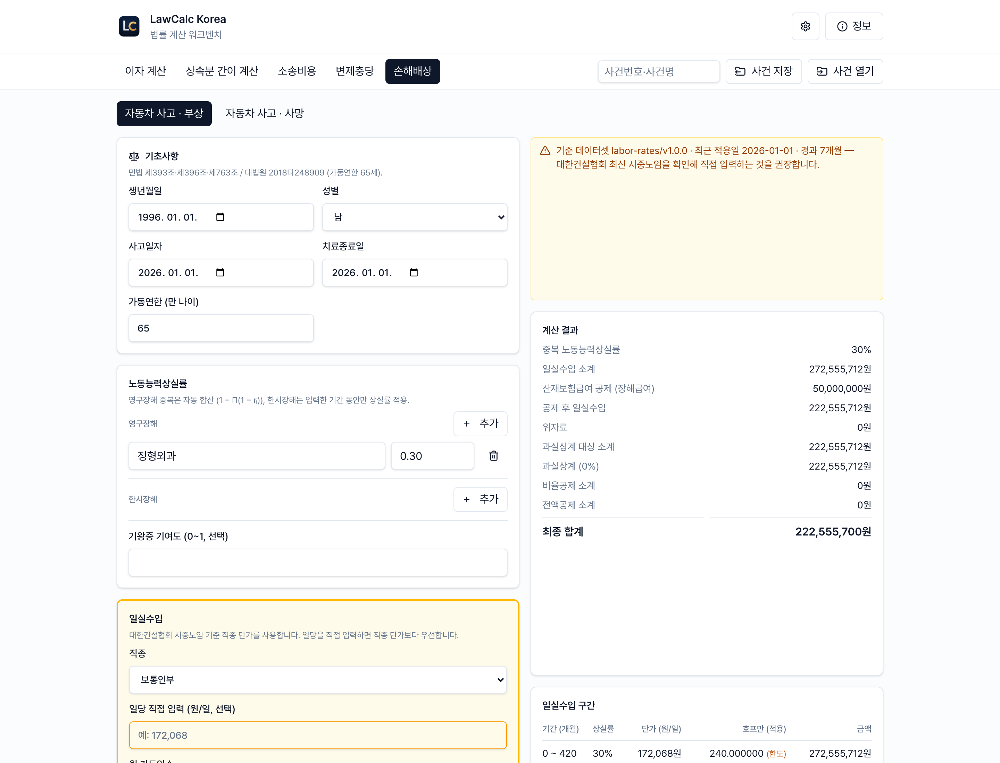
</p>

**기타손해**는 개호비·치료비·보조구를 부상·사망 어느 쪽에든 더 넣을 수 있습니다.

- **개호비**는 기왕분과 향후분으로 나뉩니다. 월 개호일수는 기본 365/12일(약 30.42일)이고 소수도 넣을 수 있습니다. 기왕분은 직종·총일수로 계산하고(실제 지출액이 있으면 그 금액으로), 향후분은 기간·인원을 넣으면 일실수입처럼 중간이자로 환산합니다(호프만 240개월 한도).
- **치료비·보조구**는 1회성·반복 지출을 필요일과 수명으로 넣으면, 발생 시점마다 현재가치로 환산합니다. 수치합계가 한도(20)를 넘으면 한도까지만 인정하고 빨간색으로 표시합니다.

기타손해는 일실수입·장례비와 함께 과실상계 전 손해에 더해지고(위자료는 과실상계 뒤에 더합니다), 결과 카드와 PDF·CSV에 항목별로 나옵니다. 일실퇴직금은 아직 넣지 않았습니다.

<p align="center">
  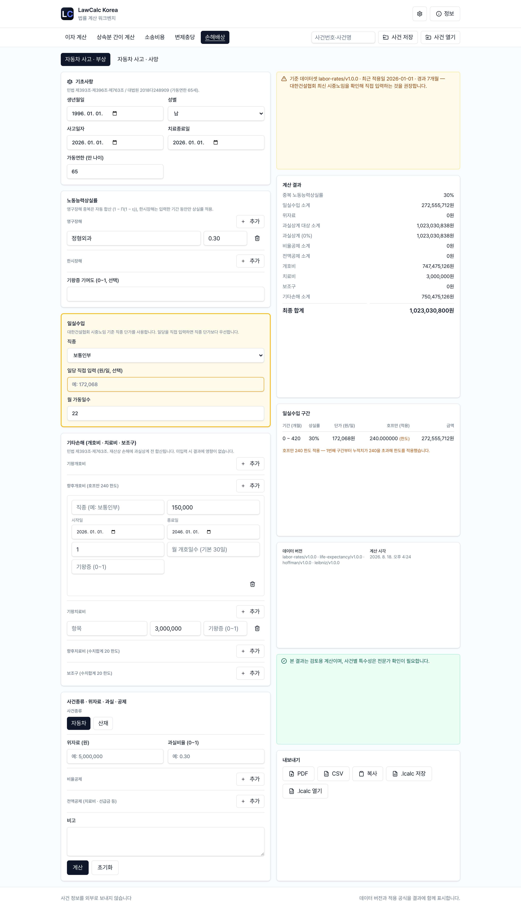
</p>

어떤 조합으로 계산하든, 결과에는 사용한 데이터셋(`labor-rates` / `life-expectancy` / `hoffman` / `leibniz`) 식별자가 붙고, 대한건설협회 시중노임 스냅샷이 얼마나 오래됐는지도 함께 표시합니다.

| 데이터셋                            | 출처와 처리                                                                                                               |
| ----------------------------------- | ------------------------------------------------------------------------------------------------------------------------- |
| `labor-rates/v1.0.0`                | 대한건설협회 시중노임 단가. 출처와 스냅샷 시점을 명시해 번들하고, 직종 자동입력과 일당 직접 입력을 항상 함께 제공합니다.  |
| `life-expectancy/v1.0.0`            | 통계청 KOSIS 생명표. KOSIS 이용 안내에서 자유 이용·재사용·재배포가 허용됨을 확인했고, 출처표시·왜곡 금지 원칙을 따릅니다. |
| `hoffman/v1.0.0` / `leibniz/v1.0.0` | 할인율 5% 기준 정적 수학표. 호프만 표는 월 단위 단리연금현가율과 240 한도를 담고 있습니다.                                |

### 기간 계산

<p align="center">
  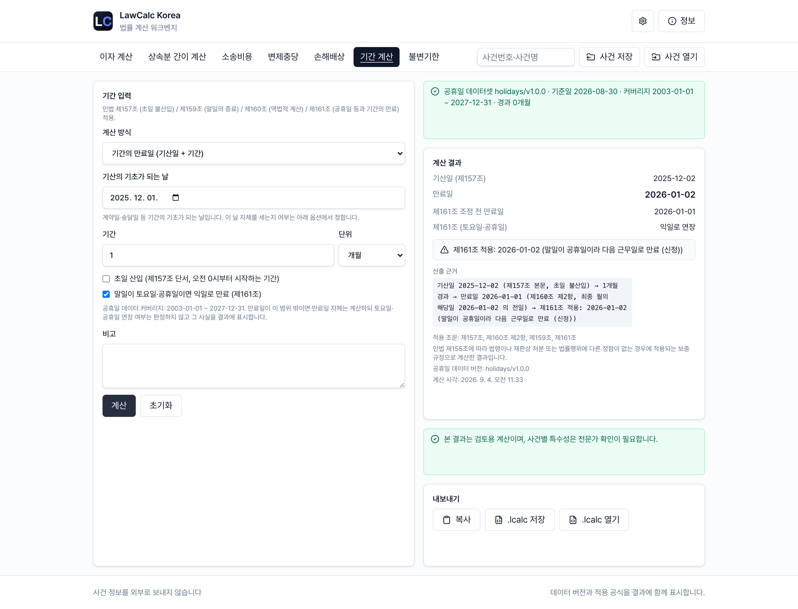
</p>

기산의 기초가 되는 날과 기간을 넣으면 만료일이 나오고, 두 날짜를 넣으면 그 사이 일수가 나옵니다. 계약일부터 몇 개월, 송달일부터 몇 주처럼 날짜만 세면 되는 자리에 씁니다.

초일은 세지 않는 것이 기본이고(민법 제157조), 기간이 오전 0시부터 시작하면 같은 조 단서에 따라 초일을 산입하도록 켤 수 있습니다. 월과 년은 일수로 바꾸지 않고 제160조의 역법적 계산을 그대로 따릅니다. 1월 31일부터 1개월처럼 최종 월에 해당일이 없으면 그 월의 말일에 만료합니다(제160조 제3항).

말일이 토요일이나 공휴일이면 익일에 만료하는 제161조는 켜고 끌 수 있습니다. 다만 만료일이 2008년 3월 22일 전의 토요일이면 연장 여부를 판정하지 않습니다(민법 제161조를 개정한 법률 제8720호 부칙 제1조 단서의 시행일이 2008년 3월 22일입니다). 결과에는 조정 전 만료일과 조정 후 만료일이 나란히 나와서 며칠이 밀렸는지, 무엇 때문에 밀렸는지 보입니다.

> 공휴일 데이터는 2003년부터 2027년까지 담고 있습니다. 만료일이 이 범위 밖이면 만료일 자체는 내되 토요일·공휴일 연장 여부는 판정하지 않고, 판정하지 못했다는 사실을 결과에 표시합니다. 연장이 필요 없다는 것과 판정하지 못했다는 것은 다른 사실이기 때문입니다. 2027년 값은 아직 확정 고시 전의 예보를 바탕으로 한 것이라, 계산에 쓰기 전에 화면의 데이터 기준일을 확인해 주세요.

### 불변기한

<p align="center">
  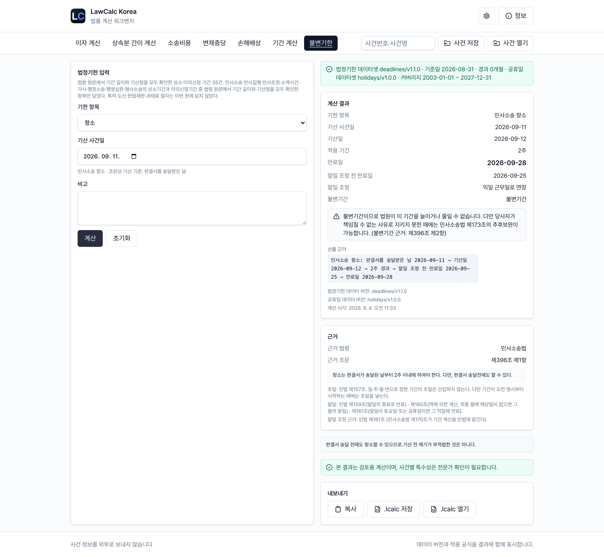
</p>

항소·상고·즉시항고·지급명령 이의·재심·취소소송 제소기간 등 35가지 법정기한의 만료일을 계산합니다. 민사소송·민사집행·민사조정·소액사건·가사·행정소송·행정심판·형사소송을 담고 있고, 특허와 도산, 헌법재판, 과태료는 아직 담지 않았습니다.

기한마다 무엇으로부터 기산하는지가 다릅니다. 판결서를 송달받은 날, 재판을 고지받은 날, 재판을 선고 또는 고지한 날, 처분이 있음을 안 날이 조문마다 갈리므로, 고른 기한의 기산 기준을 날짜 입력란 옆에 함께 보여 줍니다.

그 기간이 불변기간인지도 함께 표시합니다. 불변기간은 법원이 늘이거나 줄일 수 없고, 당사자가 책임질 수 없는 사유로 지키지 못한 때에는 추후보완이 가능합니다(민사소송법 제173조). 표시는 **불변기간**, **불변기간 아님**, **법령에 표시 없음** 세 가지입니다. 법령에 불변기간 표시가 없는 기한을 '불변기간 아님'으로 묶지 않는 이유는, 조문이 말하지 않은 것을 이 프로그램이 대신 단정하지 않기 위해서입니다. 가사소송의 항소·상고와 가사비송 즉시항고가 여기에 해당합니다.

취소소송의 1년(행정소송법 제20조 제2항)이나 행정심판의 180일(행정심판법 제27조 제3항)처럼 "정당한 사유가 있으면 그러하지 아니하다"는 단서가 붙은 기한은 만료일과 함께 그 사실을 경고로 띄웁니다. 만료일을 절차가 봉쇄되는 날로 읽으면 안 되는 항목입니다.

말일이 토요일이나 공휴일일 때의 근거는 계열마다 다릅니다. 민사는 민법 제161조로 익일에 만료하고, 형사는 형사소송법 제66조 제3항으로 그날을 기간에 산입하지 않습니다. 화면의 근거도 고른 기한의 계열을 따라갑니다. 공휴일 데이터의 커버리지 한계는 기간 계산과 같습니다.

기간의 길이와 근거 조문은 35건 전부 법제처 원문으로 대조했습니다. 자세한 범위는 [docs/LEGAL_REFERENCES.md](docs/LEGAL_REFERENCES.md)의 '현재 기간·불변기한 범위'에 있습니다.

### 공통 기능

<p align="center">
  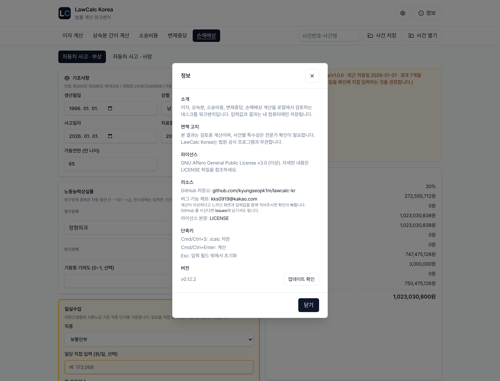
</p>

- **법정이율 데이터셋**: 민법 5%, 상법 6%, 소촉법 등 이율 변경 이력을 버전으로 관리합니다.
- **계산 옵션**: 초일 산입 여부, 윤년 처리, 원 단위 절사·절상·반올림을 고를 수 있습니다.
- **로컬 저장 (`.lcalc`)**: 입력값·옵션·결과·데이터 버전을 한 파일에 담아 같은 계산을 다시 엽니다.
- **사건 파일**: 사건번호·사건명을 적고 '사건 저장'을 누르면 입력해 둔 탭들의 계산이 한 파일로 묶이고, '사건 열기'로 각 탭이 그대로 복원됩니다. 탭을 옮겨 다녀도 입력값은 유지됩니다.
- **내보내기**: PDF, CSV, 클립보드 텍스트.

## 다운로드

릴리스 자산은 [GitHub Releases](https://github.com/kyungseopk1m/lawcalc-kr/releases/latest)에 있습니다.

### macOS

**Homebrew (권장)**

```bash
brew tap kyungseopk1m/lawcalc-kr
brew trust kyungseopk1m/lawcalc-kr
brew install --cask lawcalc-kr
```

`brew trust`는 서드파티 tap을 신뢰하는 단계로, 최초 1회만 실행하면 됩니다.

또는 `.dmg`를 직접 받아 앱을 Applications로 옮기고 실행해도 됩니다. 아직 Apple Notarization을 하지 않아 Gatekeeper 경고가 뜰 수 있습니다. 이때는 Finder에서 앱을 **Control-클릭 → 열기** 하거나, **시스템 설정 → 개인정보 보호 및 보안**에서 실행을 허용하면 됩니다.

### Windows

`setup.exe`를 받아 설치 마법사를 따라가면 됩니다. 기관·관리자 배포가 필요하면 `.msi`를 쓰세요. Windows SmartScreen이 '게시자 확인 안 됨'으로 막을 수 있는데, 직접 받은 파일이 맞다면 **추가 정보 → 실행**으로 넘어가면 됩니다.

`latest.json`, `.sig`, `.app.tar.gz`는 인앱 자동업데이트 검증용이라 직접 받을 필요는 없습니다.

## `.lcalc` 파일

`.lcalc`는 입력값·옵션·데이터 버전·결과·면책 고지를 담은 JSON 파일입니다. 사건 정보는 이 파일에만 남고 어디로도 전송되지 않습니다.

저장 형식은 `schemaVersion: "3"`이며, `kind`로 계산 종류(`interest` / `inheritance` / `litigation-cost` / `appropriation` / `compensation` / `case`)를 구분합니다. 사건 파일(`case`)은 여러 계산을 함께 품고 있어서, 안에 든 계산 하나만 떼어 내도 단독 파일로 열립니다. 옛 버전(v0.1.x·v0.2.x) 파일은 열 때 현재 형식으로 자동 변환됩니다.

## 개발

Node.js 24 · pnpm 10 · Rust stable이 필요합니다.

```bash
pnpm install
pnpm tauri:dev      # 데스크톱 앱 개발 모드
pnpm tauri:build    # 릴리스 패키징 (.dmg / .msi)
pnpm test           # 단위·통합 테스트
pnpm test:golden    # 골든 케이스 회귀 테스트
pnpm lint           # ESLint + Prettier
node scripts/capture-screens.mjs  # README 스크린샷 재캡처
```

기여 절차·릴리스 워크플로·테스트 정책은 [`CONTRIBUTING.md`](CONTRIBUTING.md)에 있습니다.

버그 신고와 기능 제안은 [Issues](https://github.com/kyungseopk1m/lawcalc-kr/issues)로 받습니다. GitHub 계정이 없으시면 앱의 **정보 다이얼로그**에 적힌 메일 주소로 보내주셔도 됩니다.

## 헌사 / Acknowledgments

이 프로젝트는 2007년 광주지방법원 정경현 부장판사님이 업무용 계산프로그램(VK.EXE)을 일반 공개하면서 시작된 흐름 위에 있습니다. 법률 계산 도구를 모두에게 열어 주신 그 결정에 깊은 경의를 표합니다.

This project stands on the shoulders of Hon. Jung Kyungheon (J., Gwangju District Court), whose 2007 public release of the VK.EXE court calculation utility first made these calculations accessible to everyone.

## 라이선스

GNU Affero General Public License v3.0 이상으로 배포합니다. 누구나 자유롭게 쓰고 고치고 재배포할 수 있습니다. 다만 수정본을 네트워크 서비스로 제공하거나 재배포할 때는 같은 라이선스로 소스를 공개해야 합니다. 자세한 내용은 [LICENSE](LICENSE)에 있습니다. 상업 라이선스가 필요하면 저작권자(kyungseopk1m)에게 문의해 주세요.

> **의무 발동 조건 예시**
>
> - 변호사·법무팀이 사무소·기업 내부에서 데스크톱 앱으로 사용 → AGPL 의무 발동 없음 (내부 사용).
> - 이 코드를 SaaS·웹·다중 사용자 시스템에 통합해 외부에 제공 → 같은 라이선스로 소스 공개 강제.

## English

LawCalc Korea is a local desktop app for Korean legal calculations: judgment interest and delay damages, simplified inheritance shares, litigation costs, payment appropriation, accident compensation for auto accidents and industrial accidents in injury and death modes, statutory period calculation under the Civil Act, and expiry dates for 35 procedural deadlines.

It runs on macOS and Windows, keeps case data on the user's computer, shows how every result was derived, and saves reproducible `.lcalc` files with versioned data.

Distributed under the GNU Affero General Public License v3.0 or later. Any modified version made available to users over a network, or redistributed as a derivative work, must be released under the same license with source code available. See [LICENSE](LICENSE) for the full text. For commercial licensing inquiries, please contact the Licensor (kyungseopk1m).
